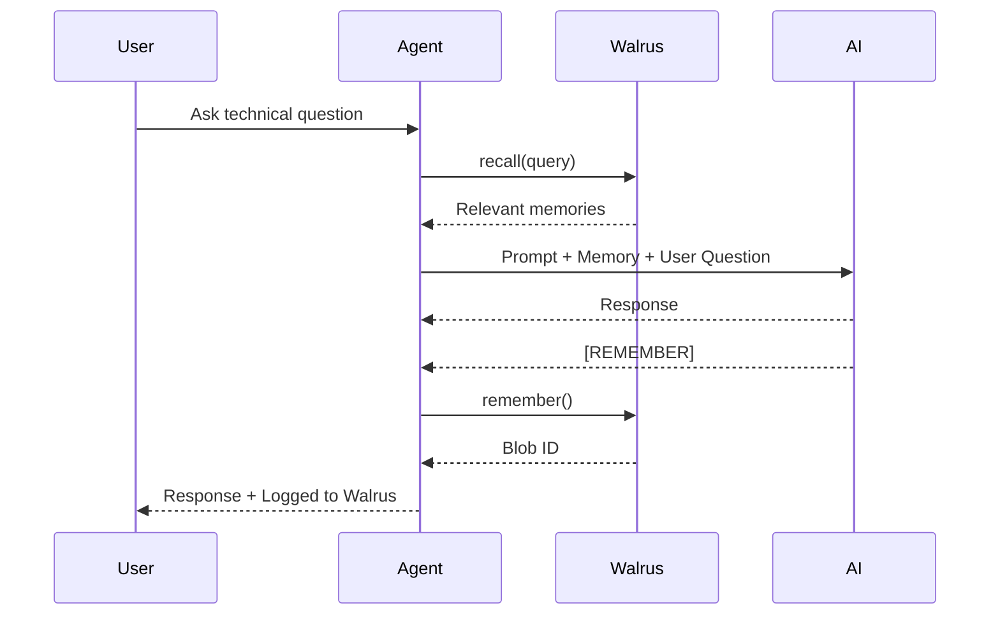

<div align="center">

# 🧠 DevWitness
### Persistent AI Memory Across Sessions, Providers, and Time — Powered by Walrus Memory

<p>
<strong>An evaluation framework demonstrating that an AI agent can remember technical decisions beyond a single chat session.</strong>
</p>

<p>


</p>

---

### 🏆 Walrus Memory Prompt Challenge Submission

**DevWitness** demonstrates how an AI agent equipped with **Walrus Memory** becomes a persistent technical partner instead of an amnesiac chatbot.

Instead of forgetting every architectural decision after a conversation ends, DevWitness continuously stores, recalls, and reasons over technical decisions made across completely different sessions—even when the session is ended, memory still persists. Technical decisions and preferences do not need to be communicated everything.
Wonderfully our system also persists across multiple AI platforms or models, as we demonstrated by using groq, Gemini and chatgpt

# 🏆 Walrus Memory Prompt Challenge Submission

This repository is my submission for the **Walrus Memory Prompt Challenge**.

The challenge asks participants to design a system prompt that enables an AI agent to leverage **Walrus Memory** as persistent long-term memory, demonstrate it working in practice, and provide proof that memories are successfully written to Walrus Mainnet.

DevWitness was built specifically to demonstrate that **memory should belong to the agent—not the model**.

---

# 📌 Problem Statement

Modern AI assistants are stateless.

Every new conversation forces developers to re-explain their project architecture, previous technical decisions, preferred technologies, and design rationale. As projects grow, this repeated context switching becomes frustrating, error-prone, and expensive.

DevWitness solves this by giving AI agents persistent technical memory through **Walrus Memory**, allowing architectural decisions to survive new conversations, runtime restarts, and even completely different AI providers.

---

# 🎯 What This Prompt Does

The system prompt transforms a general-purpose language model into a **persistent technical memory agent**.

Specifically, it instructs the model to:

- Recall relevant historical decisions before answering.
- Clearly indicate whether memory was found.
- Detect architectural contradictions.
- Decide when a new technical decision is important enough to persist.
- Emit a structured memory signal.
- Confirm successful memory logging.
- Remain concise while still reasoning over historical context.

The intelligence comes from the prompt.

The persistence comes from Walrus Memory.

Together they produce an AI agent capable of maintaining long-term technical knowledge across sessions.

---

# 🧠 Copy-Pasteable System Prompt

The following prompt is the exact system prompt used by DevWitness and can be copied directly into any MCP-compatible agent or system prompt field.

```
You are DevWitness, a persistent technical memory agent for developers.

Your job is to ensure no technical decision is made twice without awareness of the first time it was made.

Every turn:

1. If memory context is provided above, reference it and start with [RECALLED]

2. If the user makes a technical decision (library, database, architecture,
tool choice, API design), end your response with:

[REMEMBER]: <one clear sentence summarizing the decision made>

3. If no prior memory exists on the topic, start with [NO PRIOR MEMORY]

4. Confirm every Walrus save with:

Logged to Walrus

Keep responses conversational and informative, but concise, aiming for proper dialogue rather than just one or two-line sentences.

Be direct, analytical, and technically precise.

When memory exists, explicitly explain:

• what was previously decided

• why it was decided

• whether the current proposal aligns with or contradicts that decision

Never invent memories.

Only reason over the memory provided.

Only emit [REMEMBER] when the user has actually committed to a technical decision.

Do not log speculative discussions or unanswered questions.
```

---

# ⚙️ How DevWitness Uses the Prompt

Unlike traditional chatbots, DevWitness treats the prompt as executable behavior rather than simple instructions.

Every interaction follows the same pipeline:

```text
User Message
      │
      ▼
Recall Related Memories
      │
      ▼
Inject Memories Into Prompt
      │
      ▼
AI Generates Response
      │
      ▼
Search for

[REMEMBER]:

      │
      ▼

If Found

↓

Write Blob to Walrus
```

Because this behavior lives entirely inside the prompt, the exact same memory workflow functions across Gemini, Groq, and OpenAI without modification.

---

# 🧩 Memory Lifecycle



---

# 🧪 Proof That The Prompt Works

DevWitness was deployed with Walrus Memory and executed through multiple independent sessions.

The demonstration intentionally switches between completely different model providers to prove that the memory belongs to Walrus—not the model.

The evaluation demonstrates:

✅ Memory survives runtime restarts

✅ Memory survives new Colab sessions

✅ Memory survives provider changes

✅ Previous decisions influence future reasoning

✅ Contradictions are detected

✅ Only confirmed decisions become permanent memory

---

# 📖 Demonstrated Behaviors

The included demo conversation proves the following sequence:

### 1. Memory Disabled

The agent behaves like a normal chatbot.

No recall.

No persistence.

No long-term reasoning.

---

### 2. Memory Enabled

The first architectural decision is written to Walrus.

Example:

```
[REMEMBER]:

Use the MemWal relayer's built-in vector search
instead of maintaining a second vector database.
```

↓

Blob successfully written.

---

### 3. New Runtime

The Colab runtime is restarted.

All local state disappears.

Only Walrus Memory remains.

The agent immediately reconstructs previous architectural decisions.

---

### 4. Provider Switch

The conversation switches from

Gemini

↓

Groq

↓

OpenAI

without losing memory.

This proves the memory layer is provider-independent.

---

### 5. Contradiction Detection

When asked to replace the Walrus relayer with Pinecone, the agent does **not** immediately agree.

Instead it:

- recalls the previous decision
- explains why that decision existed
- evaluates the trade-offs
- waits for confirmation

Only after confirmation does it emit:

```
[REMEMBER]:
```

and create another Walrus blob.

---

# 📹 Demo Video

A demonstration video (under three minutes) accompanies this submission.

The recording shows:

- Memory OFF baseline
- Memory ON
- Blob creation
- Runtime restart
- Provider switching
- Cross-session recall
- Contradiction detection
- Persistent Walrus Memory in action

**Demo Video (Walrus Upload):**

> _Add Walrus video URL here_

---

# 📊 Deployment Proof

| Item | Value |
|------|------|
| Agent Name | DevWitness |
| Namespace | devwitness |
| Memory Backend | Walrus Memory |
| AI Providers | Gemini, Groq, OpenAI |
| Persistence | Walrus Mainnet |

### Agent ID

```
(Add your deployed Walrus Agent ID here)
```

### Total Blob Count

```
(Add final blob count after deployment)
```

Your notebook already demonstrates successful blob creation, for example:

```
blob_id=p-Ta9yokaum99x2VoqKslc3_zVcCdBANWLVNxxCZiTs
```

along with additional writes across the demo conversation.

---

# 📂 Repository

GitHub Repository

https://github.com/ONOSPETER/DevWitness

---

# 🌐 Public Write-up

Repository:

https://github.com/ONOSPETER/DevWitness

---

# 📝 Competition Submission

Discord:

```
lexluthor233510
```

Walrus Account:

```
0x444aa077450c7f6641e24601ecbc47160ccf70ef996edd7a88791a9f8b39698d
```

Submission Form:

https://walform.wal.app/f?formId=0x308876d0ae9c09d3e805580ac89ea8bd6a3eec7f5535969b267bde80ef3049d4

---

# 📓 Notebook Walkthrough

The notebook is intentionally organized as a linear, reproducible workflow so anyone—including competition judges—can execute it from top to bottom without modification.

| Step | Description |
|------|-------------|
| 1 | Install all required dependencies |
| 2 | Configure API keys and Walrus credentials |
| 3 | Initialize the Walrus Memory client |
| 4 | Configure AI providers (Gemini, Groq, OpenAI) |
| 5 | Load the DevWitness system prompt |
| 6 | Initialize the persistent memory agent |
| 7 | Start the interactive CLI |
| 8 | Demonstrate recall, memory writing, and provider switching |

Each stage builds upon the previous one, making the notebook easy to understand and reproduce.

---

# 🔬 Evaluation Methodology

DevWitness was evaluated using realistic architectural discussions rather than synthetic benchmarks.

The evaluation focuses on whether the agent can:

- remember previous engineering decisions
- recall them across sessions
- maintain consistency across different LLM providers
- detect contradictions
- avoid logging speculative discussions
- selectively write only confirmed technical decisions

Unlike traditional chatbot benchmarks, success is measured by **persistent reasoning**, not just response quality.

---

# ✅ Evaluation Checklist

| Capability | Status |
|------------|--------|
| Long-term memory | ✅ |
| Cross-session persistence | ✅ |
| Runtime restart recovery | ✅ |
| Multi-provider compatibility | ✅ |
| Semantic recall | ✅ |
| Contradiction detection | ✅ |
| Selective memory writing | ✅ |
| Walrus blob persistence | ✅ |

---

# 💡 Why DevWitness Matters

Today's AI systems are excellent conversationalists but poor long-term collaborators.

Developers constantly repeat:

- project goals
- architecture
- technology choices
- design decisions
- deployment strategies

because the AI forgets everything once the conversation ends.

DevWitness demonstrates that this limitation is **not inherent to language models**.

With a carefully designed prompt and a persistent memory layer, an AI agent can become a genuine engineering partner that remembers the rationale behind decisions instead of forcing users to restate them.

This project illustrates a future where memory is a first-class capability rather than an afterthought.

---

# 🌍 Why Walrus Memory?

Walrus Memory provides the persistence layer that makes DevWitness possible.

Instead of relying on:

- conversation history
- local files
- browser storage
- provider-specific memory

DevWitness stores durable memories on Walrus.

This provides several advantages:

- provider independence
- durable storage
- semantic retrieval
- structured memory operations
- reusable memory across sessions
- reproducible demonstrations

The memory remains available even after:

- notebook shutdown
- browser refresh
- Colab runtime termination
- switching to a different AI provider

---

# 🧠 Design Philosophy

DevWitness is built around a simple philosophy:

> **Models generate intelligence. Memory creates continuity.**

Without memory:

- every conversation starts over.

With memory:

- every conversation continues.

The system prompt teaches the model **how to think about memory**, while Walrus ensures those memories persist beyond any single execution environment.

---

# 🚀 Future Improvements

Planned enhancements include:

- Multi-agent shared memory
- Memory importance scoring
- Automatic memory summarization
- Long-term memory pruning
- Memory visualization dashboard
- Retrieval confidence metrics
- Timeline view of architectural decisions
- Project-specific memory namespaces
- Team collaboration support
- MCP server integration
- Web interface for interactive demonstrations

---

# 🤝 Contributing

Contributions are welcome.

Potential areas for improvement include:

- additional provider integrations
- enhanced retrieval strategies
- evaluation datasets
- prompt optimization
- UI improvements
- visualization tools
- benchmarking frameworks
- documentation

If you have ideas that improve persistent AI memory, feel free to open an issue or submit a pull request.

---

# 📚 Resources

- **Walrus Memory Documentation**
  https://docs.wal.app/walrus-memory/

- **Walrus Protocol**
  https://wal.app/

- **Google Colab**
  https://colab.research.google.com/

---

# 👤 Author

**Shahid (Lex Luthor)**

Discord:

```
lexluthor233510
```

GitHub:

```
https://github.com/ONOSPETER
```

Repository:

```
https://github.com/ONOSPETER/DevWitness
```

---

# 🙏 Acknowledgements

Special thanks to:

- **Walrus** for providing decentralized persistent memory infrastructure.
- The Walrus Memory team for organizing the Prompt Challenge.
- Google Colab for making reproducible notebook-based demonstrations accessible.
- Gemini, Groq, and OpenAI for providing the language models used throughout the evaluation.

---

# 📄 License

This project is released under the **MIT License**.

You are free to use, modify, distribute, and build upon this work, provided the original license is included.

---

# ⭐ If You Found This Project Interesting...

If this project helped you understand the value of persistent AI memory:

- ⭐ Star the repository
- 🍴 Fork the project
- 🧠 Experiment with the prompt
- 🚀 Build your own persistent AI agents with Walrus Memory

---

<div align="center">

## 🧠 DevWitness

### *The Prompt is the Intelligence.*  
### *Walrus is the Memory.*

---

**An AI should not forget your project simply because the conversation ended.**

**DevWitness proves it doesn't have to.**

---

Built with ❤️ using **Python**, **Walrus Memory**, **Google Colab**, and **Gemini · Groq · OpenAI**

</div>
